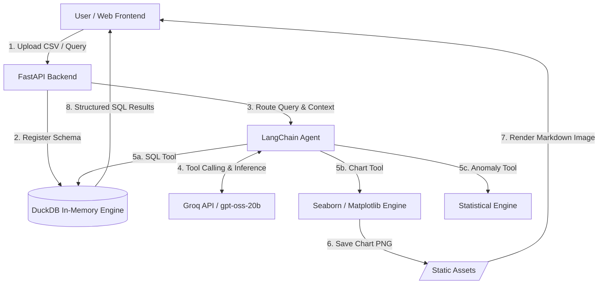
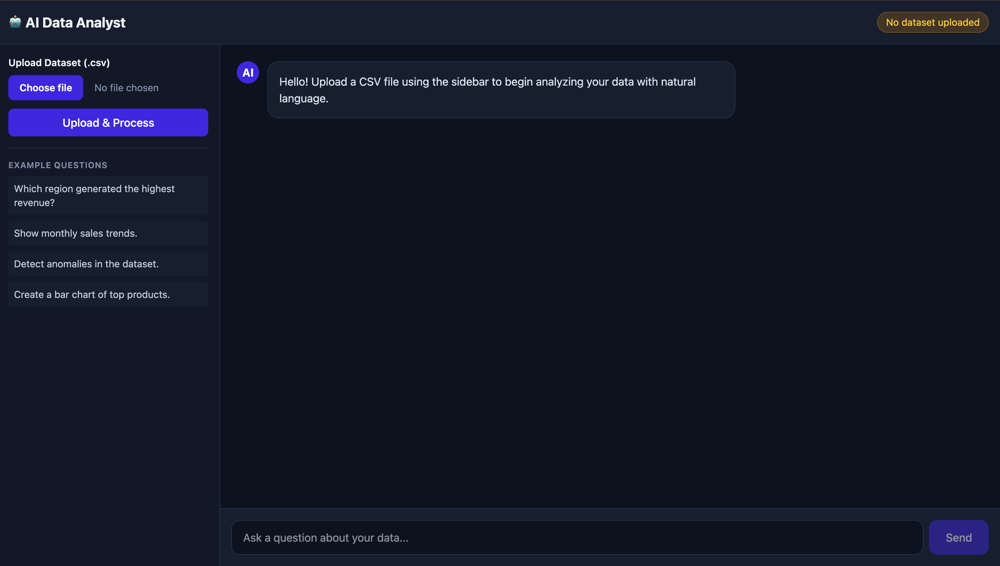
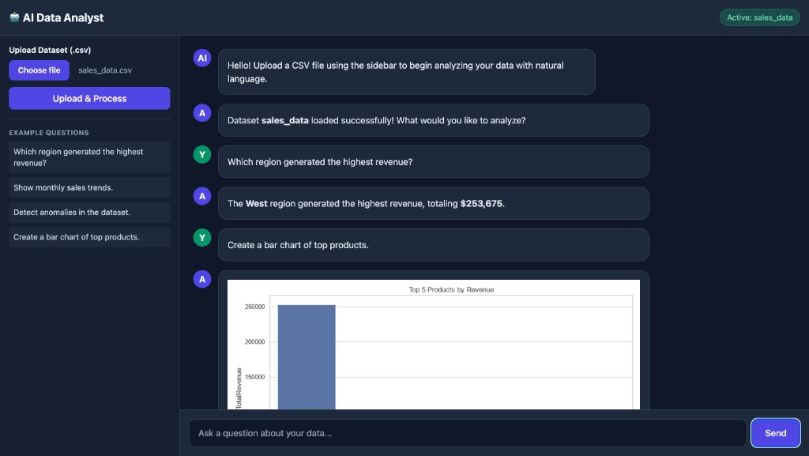

# AI Data Analyst

An intelligent, autonomous Data Analytics Assistant powered by **FastAPI**, **LangChain**, **DuckDB**, and **Groq LLMs**. Upload any CSV dataset and perform natural language querying, automated SQL generation, statistical anomaly detection, and dynamic data visualization in real time.

---

## Key Features

* **Natural Language to SQL**: Converts plain English user queries into optimized SQL statements executed against an in-memory DuckDB database.
* **Autonomous Chart Generation**: Generates custom visualizations (Bar, Line, Scatter, Pie charts) using Seaborn/Matplotlib and renders them natively within the chat UI.
* **Statistical Anomaly Detection**: Built-in statistical analysis tools (Z-score evaluation) to detect outlier data points automatically.
* **High-Performance Inference**: Powered by Groq-hosted open-weights LLMs for fast, low-latency reasoning and function calling.
* **Docker Containerized**: Fully isolated, single-command setup using Docker and environment injection.
* **Modern Web UI**: Responsive dark-mode frontend with dynamic prompt shortcuts and instant Markdown formatting.

---

## System Architecture



---

## Screenshots & Demo




### Video Demonstration


* **Short Demo Video**: [Watch Demo Video](https://www.google.com/search?q=docs/demo.mp4) *(or replace with YouTube/Loom link)*

---

## Tech Stack

* **Backend Engine**: Python 3.10+, FastAPI, Uvicorn
* **AI & Agent Orchestration**: LangChain, Pydantic v2
* **LLM Provider**: Groq API (`openai/gpt-oss-20b` / `llama-3.3-70b-versatile`)
* **Database Engine**: DuckDB (In-Memory SQL OLAP)
* **Data Science & Visualization**: Pandas, Matplotlib, Seaborn, NumPy
* **Frontend**: Vanilla HTML5, CSS3, JavaScript (Fetch API), Marked.js
* **Containerization**: Docker

---

## Repository Structure

```text
├── app/
│   ├── main.py              # FastAPI application entrypoint & API routes
│   ├── agent.py             # LangChain agent configuration & system prompts
│   ├── config.py            # Pydantic settings & environment validation
│   ├── data_loader.py       # DuckDB dataset management module
│   └── tools/               # Agent tool implementations
│       ├── sql_tool.py      # DuckDB SQL execution tool
│       ├── chart_tool.py    # Seaborn visualization tool
│       └── anomaly_tool.py  # Statistical Z-score anomaly detection tool
├── sample_data/
│   └── sales_data.csv       # Sample dataset for immediate testing
├── static/
│   ├── index.html           # Modern dark-mode frontend interface
│   └── charts/              # Directory for generated visualization PNGs
├── docs/                    # Screenshots and demo video assets
├── .env                     # Environment variable configuration (Ignored by Git)
├── Dockerfile               # Docker container definition
├── .dockerignore            # Docker build exclusion rules
├── requirements.txt         # Python dependency manifest
└── README.md                # Project documentation

```

---

## Getting Started

### Prerequisites

* **Python 3.10+**
* **Docker Desktop** (Optional, for containerized run)
* **Groq API Key** (Obtain a free key at [console.groq.com](https://console.groq.com/))

---

### Option 1: Quick Run with Docker (Recommended)

1. **Clone the repository**:
```bash
git clone [https://github.com/vanig245/ai-data-analyst.git](https://github.com/vanig245/ai-data-analyst.git)
cd ai-data-analyst

```


2. **Configure Environment Variables**:
Create a `.env` file in the root directory:
```env
GROQ_API_KEY=your_groq_api_key_here

```


3. **Build the Docker Image**:
```bash
docker build -t ai-data-analyst .

```


4. **Run the Docker Container**:
```bash
docker run -d -p 8000:8000 --name ai-analyst-container --env-file .env ai-data-analyst

```


5. **Access the Application**:
Open your browser and navigate to `http://localhost:8000`

---

### Option 2: Local Environment Setup

1. **Clone & Navigate**:
```bash
git clone [https://github.com/vanig245/ai-data-analyst.git](https://github.com/vanig245/ai-data-analyst.git)
cd ai-data-analyst

```


2. **Set up Virtual Environment**:
```bash
python -m venv venv
source venv/bin/activate  # On Windows: venv\Scripts\activate

```


3. **Install Dependencies**:
```bash
pip install --upgrade pip
pip install -r requirements.txt

```


4. **Configure Environment**:
Create `.env` in the root directory:
```env
GROQ_API_KEY=your_groq_api_key_here

```


5. **Launch Server**:
```bash
uvicorn app.main:app --host 0.0.0.0 --port 8000 --reload

```


6. **Open Dashboard**:
Visit `http://localhost:8000` in your browser.

---

## Sample Dataset & Example Prompts

A pre-configured sample dataset (`sales_data.csv`) is provided in the `sample_data/` folder.

### Example Queries to Try:

1. **General Query**: *"Which region generated the highest revenue?"*
2. **Data Visualization**: *"Create a bar chart of top 5 products by total revenue."*
3. **Trend Analysis**: *"Create a line chart showing monthly sales trends."*
4. **Anomaly Detection**: *"Detect statistical anomalies in the dataset."*
5. **Raw SQL Request**: *"Generate a SQL query to find top products, but do not execute it."*

---


```
